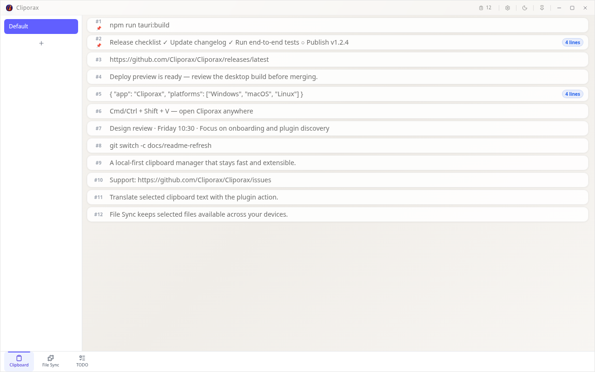
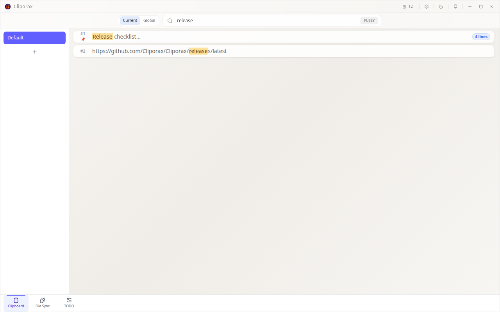
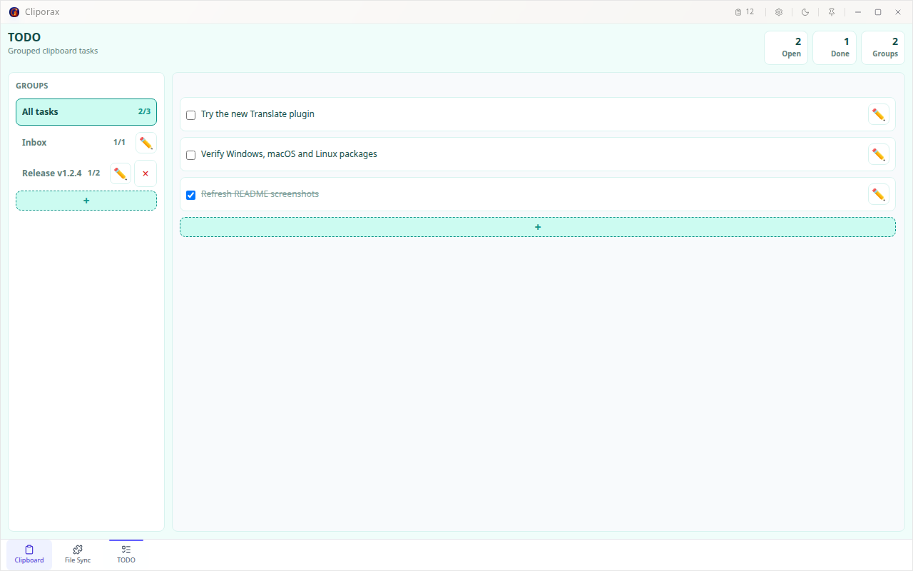
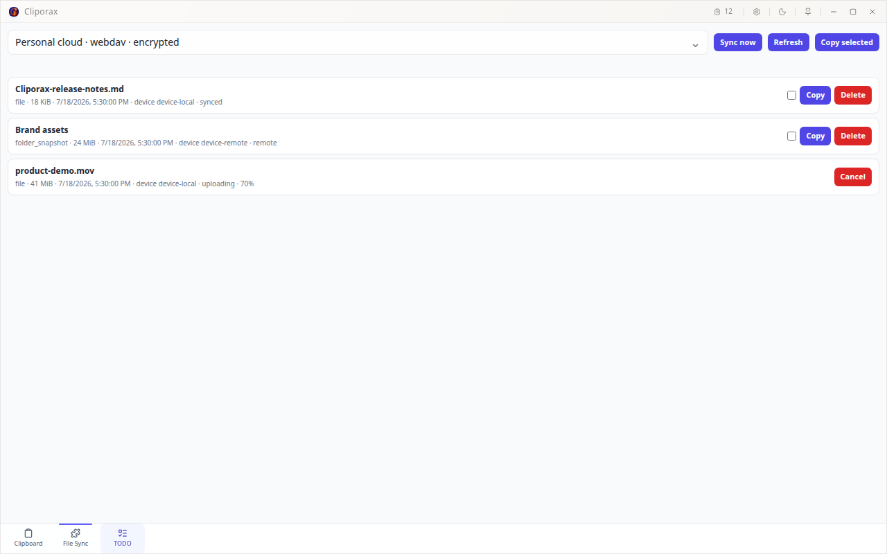

<div align="center">
  
  <h1>Cliporax</h1>
  <p>适用于 Windows、macOS 和 Linux 的快速、本地优先剪贴板管理器。</p>

  [](https://github.com/Cliporax/Cliporax/releases/latest)
  [](#安装)
  [](LICENSE)

  [下载安装](https://github.com/Cliporax/Cliporax/releases/latest) · [快速上手](#快速上手) · [插件扩展](#用插件扩展-cliporax) · [English](README.md)
</div>

<br>



Cliporax 把复制过的文本、命令、链接和笔记放在随手可取的位置。你可以在任何应用中唤出它，搜索历史记录，再把选中的内容粘贴回刚才的应用。除非你主动配置同步，否则剪贴板历史只保存在本机。

## 安装

前往 [GitHub Releases](https://github.com/Cliporax/Cliporax/releases/latest) 下载最新版。

| 平台 | 安装包 | 安装方法 |
| --- | --- | --- |
| Windows | `.exe`（NSIS） | 运行安装程序并按提示完成安装。 |
| macOS | Apple 芯片或 Intel 版本 `.dmg` | 打开 DMG，把 Cliporax 拖入“应用程序”。 |
| Linux | `.AppImage`、`.deb` 或 `.rpm` | 直接使用 AppImage，或安装适合当前发行版的软件包。 |

当前 macOS 发布包尚未经过公证。如果首次启动被 Gatekeeper 拦截，请打开 **系统设置 → 隐私与安全性**，找到 Cliporax 并选择 **仍要打开**。

Linux 建议安装 `xclip` 和 `x11-utils`，以获得更稳定的回粘支持：

```bash
sudo apt install xclip x11-utils
```

## 快速上手

1. 像平常一样复制文本，Cliporax 会将它保存到本地历史记录。
2. 在任意应用中按 <kbd>Ctrl/Cmd</kbd> + <kbd>Shift</kbd> + <kbd>V</kbd> 唤出 Cliporax。
3. 双击一条记录，把它粘贴回刚才使用的应用。
4. 按 <kbd>Ctrl/Cmd</kbd> + <kbd>F</kbd> 搜索；以 `regx:` 开头可以使用正则表达式搜索。



你还可以置顶常用内容、用标签页整理历史，或按住 <kbd>Ctrl/Cmd</kbd> 点击多条记录进行批量操作。所有快捷键都可以在 **设置 → 快捷键** 中修改。

## 用插件扩展 Cliporax

打开 **设置 → 插件 → 插件市场**，选择插件，检查它申请的权限，然后点击 **安装**。内容标签页插件会出现在底部导航栏；操作类插件只会在适合当前剪贴板内容时显示。

官方市场目前包括：

- **TODO** — 在 Cliporax 中管理轻量、可分组的待办事项。
- **File Sync** — 通过已配置的云同步资料同步指定文件和文件夹快照。
- **Clipboard Import** — 从 CopyQ、GPaste、Ditto、Klipper、Maccy、Raycast 或 NDJSON 导出器导入文本历史。
- **Translate** — 使用可配置的服务翻译选中的剪贴板文本。
- **QR Code 与 QR Scanner** — 生成二维码，或从屏幕区域扫描二维码。
- **Image Preview** — 在可缩放、可调整大小的独立窗口中预览图片。

<table>
  <tr>
    <td width="50%"></td>
    <td width="50%"></td>
  </tr>
  <tr>
    <td align="center"><strong>TODO</strong> — 剪贴板旁的分组待办</td>
    <td align="center"><strong>File Sync</strong> — 同步远端与传输中的文件</td>
  </tr>
</table>

插件源码、清单与发布包位于 [Cliporax 插件市场](https://github.com/Cliporax/cliporax-plugin-market)。

## 从源码运行

安装 [Node.js](https://nodejs.org/)、Rust 1.77.2 或更新版本，以及 [Tauri 2 系统依赖](https://v2.tauri.app/zh-cn/start/prerequisites/)，然后运行：

```bash
npm install
npm run tauri:dev
```

使用 `npm run tauri:build` 构建发布包。CLI 使用与插件开发请查看独立文档：

- [CLI 使用说明](docs/cli-usage.md)
- [插件系统](docs/plugin-system-design.md)

## 反馈与贡献

发现问题或有新想法？请 [提交 Issue](https://github.com/Cliporax/Cliporax/issues)。欢迎参与贡献。

Cliporax 使用 [MIT License](LICENSE) 开源。
